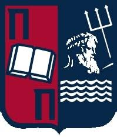

<h1 align="center">
  

  

  

<h3 align="center">Senior Data Scientist @ Elsevier | Remote from Athens 🇬🇷 | Working for Amsterdam 🇳🇱</h3>

  
  

---

## About Me

I'm a **Senior Data Scientist at Elsevier**, working remotely from Greece 🇬🇷 for the Amsterdam 🇳🇱 office.  
Previously, I worked at **Piraeus Bank**, applying data science and machine learning in the financial sector.

I'm also a 
[Certified Developer](https://www.credential.net/f14b9d58-7ae6-4d47-be33-b18393006aec#acc.V8iNQ3eg)

I specialize in **natural language processing**, **scientific text mining**, and building scalable machine learning systems.  
I enjoy teaching, mentoring, and building elegant solutions to real-world problems.

---

## Tech Stack

  <!-- Languages -->
  

  <!-- ML / Data Science Frameworks -->
  

  <!-- Dev Tools -->
  

  <!-- Cloud & Infra -->
  

---

## Current Focus

- Scientific NLP & relationship extraction  
- Virtual assistants with LangGraph
- Time series forecasting and transformer models 

---

## Featured Projects

- **🛰 Satellite Oil Storage Monitoring**  
  [Repo](https://github.com/PantosThn/Satellite-Oil-Storage-Monitoring) — predicting oil reserves using PyTorch and satellite imagery.

- **🧠 OCR Microservice with FastAPI**  
  [Repo](https://github.com/PantosThn/ocr-microservice-fastapi) — production-ready OCR pipeline using FastAPI and Tesseract.

- **📈 Time Series Tutorial**  
  [Repo](https://github.com/PantosThn/timeseries_tutorial) — hands-on notebooks covering classic + deep learning forecasting methods.

- **🧬 Scientific Relationship Extraction**  
  Proprietary @Elsevier — fine-tuning SciBERT to extract structured information from scientific literature.

---
  
## Education

-  **M.Sc. in Data Science & Machine Learning**  
  *National Technical University of Athens (NTUA)*  
  Focused on applied machine learning, deep learning, big data systems, and real-world AI applications across various domains.

-  **B.Sc. in Economics**  
  *University of Piraeus*  
  Specialized in Econometrics, statistical modeling, and data-driven economic analysis, integrating economic theory with quantitative techniques.

---

## GitHub Stats

  

---
